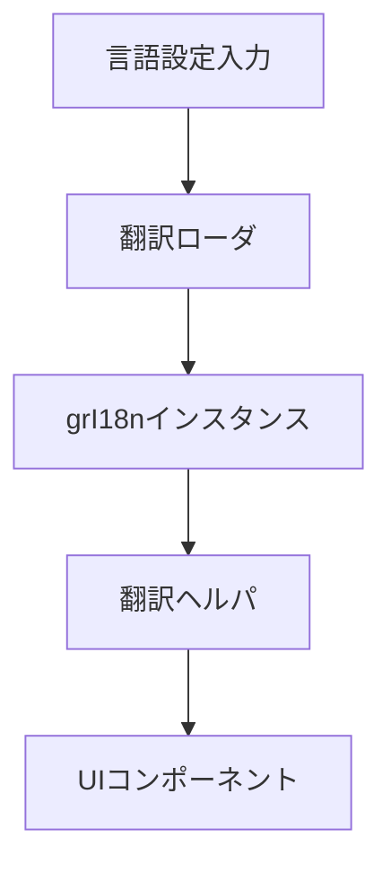

# Gradio UI 多言語化計画

## 1. 背景と目的
- [scripts/interface.py:246](scripts/interface.py:246) で `create_ui()` の結果を Gradio に登録し、UI ラベルは各ブロックにハードコードされている。
- 現状は英語固定の文字列が [scripts/ui/block_toprow.py:17](scripts/ui/block_toprow.py:17) や [scripts/ui/tab_batch_edit_captions.py:24](scripts/ui/tab_batch_edit_captions.py:24) など多数に分散しており、日本語化や多言語対応は困難。
- ユーザーからの要求は英語と日本語の切り替えに対応しつつ、Gradio の標準 `gr.I18n` を活用した運用しやすい構造を整備すること。

## 2. 対象スコープ
- Gradio ブロックとして構築されるメインタブ構成 [scripts/tab_main.py:165](scripts/tab_main.py:165) と設定タブ [scripts/tab_settings.py:42](scripts/tab_settings.py:42)。
- 共有コンポーネント群 (Toprow, Dataset Load, Gallery, Filter, Batch Edit, Edit Caption, Move/Delete) のラベル、説明文、ボタン、ツールチップ。
- ログやCLI向けメッセージは対象外だが、必要に応じて別タスクで検討可能。

## 3. 多言語化アーキテクチャ
### 3.1 gr.I18nによる翻訳配信
- `locales/<lang>.json` に翻訳キーとテキストを格納し、起動時にロードして `gr.I18n` へ渡す。
- `demo.launch(i18n=i18n_instance)` と同様に [scripts/interface.py:246](scripts/interface.py:246) で生成する `Blocks` にバインドする。
- 翻訳キーは `snake.case` を基本とし、階層は `section.component.property` の構造で統一。

### 3.2 翻訳アクセサヘルパ
- `scripts/ui/i18n_helper.py` (新規) に `translate(key: str, **kwargs)` を用意し、`gr.I18n` インスタンスをラップ。
- UI ファイルからは `from .i18n_helper import t` の形式で取得し、`label=t("toprow.save_all")` のように参照。
- 文字列整形が必要な箇所は `kwargs` で対応し、`gr.I18n` の format 機能を活用。

### 3.3 言語選択と永続化
- 言語設定は `settings.Settings` に `ui_language` を追加し、[scripts/tab_settings.py:43](scripts/tab_settings.py:43) にラジオボタンを配置。
- 設定変更時は `settings.save()` を通じて `config.json` に永続化し、再起動時に既定言語を適用。
- 将来的な拡張を想定し、サポート言語リストを `SUPPORTED_LANGS = {"en": "English", "ja": "日本語"}` のように集中管理。

### 3.4 初期化フロー
- `scripts/interface.py` 起動処理で設定値を読み取り、`i18n = build_i18n(lang=settings.current.ui_language)` を生成。
- `create_ui()` 内で `t` を `gr.Blocks` のコンテキストへ DI するか、`i18n_helper.set_translator(i18n)` を使ってグローバルに設定。
- 言語変更後の即時反映は再読み込みが最小コストのため、`"Reload UI"` ボタン ([scripts/tab_settings.py:49](scripts/tab_settings.py:49)) を活用するガイドを提示。

### 3.5 翻訳キー体系 (例)
```
locales/
  en.json
  ja.json
```
```json
{
  "toprow.save_all": "Save all changes",
  "toprow.backup_checkbox": "Backup original text file",
  "batch_edit.search_tab.title": "Search and Replace"
}
```



## 4. 実装ステップ
1. **基盤整備**
   - `locales` ディレクトリと初期 JSON (`en.json`, `ja.json`) を作成。
   - 翻訳キーの命名規約とレビュー方針を決定。
2. **ヘルパー導入**
   - `build_i18n(lang: str)` と `set_translator(i18n)` を含むヘルパーモジュールを追加。
   - ユニットテスト (言語切り替え、フォーマット適用) を追加可能なら実施。
3. **設定連携**
   - `settings.Settings` に `ui_language` を追加し、デフォルトを `"en"` に設定。
   - [scripts/tab_settings.py:43](scripts/tab_settings.py:43) に言語選択 UI を配置し、保存・復元動作を確認。
4. **UI テキスト移行 (段階的)**
   - コンポーネント毎に翻訳キーへ置き換え。優先順位: Toprow → LoadDataset → Filters → BatchEdit → EditCaption → Move/Delete。
   - 置換ごとに `ja.json` へ仮訳追加し、`en.json` を基準とする。
5. **Gradio 連携**
   - [scripts/interface.py:246](scripts/interface.py:246) の `interface.launch` に `i18n=i18n_instance` を渡す。
   - 言語変更で UI を再起動する手順を `README.md` に追記。
6. **検証**
   - 英語・日本語を切り替えて、各タブのラベル・説明文が期待通り表示されるか確認。
   - 新言語追加手順を計画書と `README.md` へ記載。

## 5. テスト計画
- 言語切り替え後に `launch_user.bat` → ブラウザアクセスで各タブ UI を手動確認。
- `locales` の未翻訳キー抽出スクリプト (簡易) を用意し、CI で検知できるようにする案を検討。
- `settings.restore_defaults()` ([scripts/tab_settings.py:78](scripts/tab_settings.py:78)) 実行時に既定言語へ戻るか確認。

## 6. リスクと緩和策
- **翻訳漏れ**: 未翻訳キーは `en.json` をフォールバックにするロジックをヘルパーに実装。
- **レイアウト崩れ**: 長文化対応として CSS の `min-width` や `wrap` 設定を個別に調整する予備タスクを用意。
- **将来の Gradio アップデート**: `gr.I18n` の API 変更に備え、ヘルパーで抽象化しアップデート時の影響範囲を局所化。

## 7. 今後のアクション
- 本計画の承認後、実装モードへ移行しステップ 1 から順次着手。
- 翻訳方針 (人手翻訳 vs 自動翻訳後レビュー) を決定し、管理フローを `locales/README.md` などで明文化。
