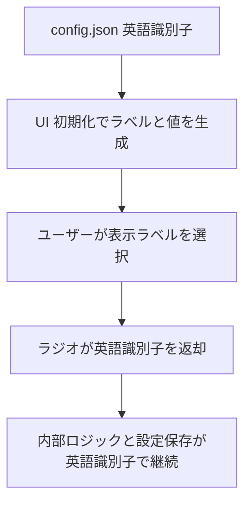

# 修正計画書: block_load_dataset.py 言語選択時のラジオエラー対策
## 背景
- UI言語を日本語に切り替えた状態で「データセット読み込み」ブロックのラジオボタンを操作すると、Gradio側で選択値が候補に存在しないとして例外が発生する。
- ラジオボタンの初期化は[`block_load_dataset.py`](scripts/ui/block_load_dataset.py:50)で行っており、選択肢は翻訳済み文字列を提示する一方、設定値`cfg_general.use_interrogator`には英語の識別子が保持されている。

## 原因分析
- Gradioの`gr.Radio`は`value`が`choices`に含まれていない場合`Error`を送出する。
- 日本語ロケールでは`choices`が`t("load_dataset.interrogator_choices.*")`を通じて翻訳済み文字列（例: "いいえ"）となる。
- 設定値は英語識別子（例: "No"）のまま[`Config`](scripts/config.py:118)→`config.json`で保存・復元されるため、ロケール切替後に値と候補が不一致となる。

## 対策方針
1. 英語識別子と翻訳キーのマッピングテーブルを定義し、`gr.Radio`の`choices`に`[(label, value), ...]`形式で渡して内部値を英語のまま保持する。
2. UI初期化時、未知の識別子が設定されていた場合はフォールバックとして"No"を選択する。
3. 既存のコールバック（`load_files_from_dir`など）では英語識別子をそのまま受け渡すため追加変換は不要。
4. 設定保存・復元や他タブでの利用状況を確認し、同様のパターンがあれば共通ヘルパー化も検討する。

## 実装タスク
1. [`block_load_dataset.py`](scripts/ui/block_load_dataset.py:50)に英語識別子と翻訳キーのマッピング定義を追加し、`choices`へ`(label, value)`形式を適用。
2. 同ファイル内で設定値のフォールバック処理（存在しない場合"No"を適用）を追加。
3. 必要に応じてマッピングを共通化する際は[`ui_common.py`](scripts/ui/ui_common.py)などにヘルパー関数を追加し、他UIでの再利用可否を確認。

## テスト計画
1. 言語=en・jaの双方でUIを起動し、`Load`ボタン操作がエラーなく実行できるか確認。
2. 各選択肢を切り替えて`config.json`保存→アプリ再起動後も選択状態が保持されることを確認。
3. 不正な値を`config.json`に直接書き込み、フォールバックで"No"が選択されることを確認。
